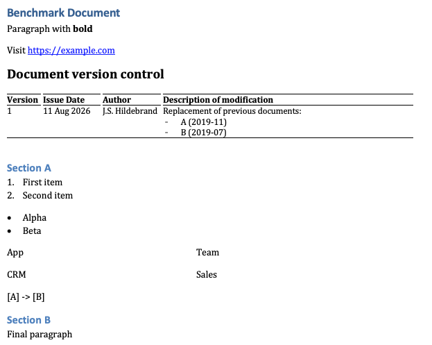
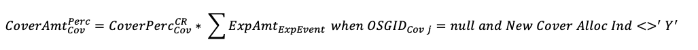
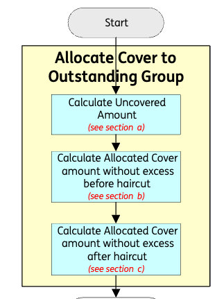
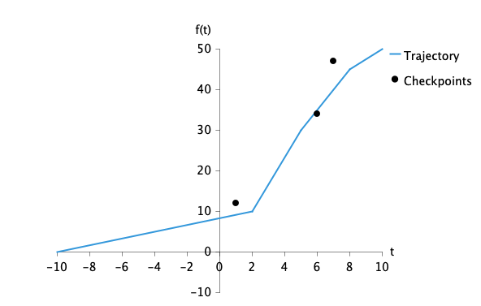

# gradle-ooxml-plugin


[](https://plugins.gradle.org/plugin/name.jurgenei.gradle.ooxml)
[](https://github.com/jurgenei/gradle-ooxml-plugin/actions/workflows/gradle-build.yml)
[](https://github.com/jurgenei/gradle-ooxml-plugin/actions/workflows/coverage.yml)
[](https://codecov.io/gh/jurgenei/gradle-ooxml-plugin)
[](LICENSE)
[](https://www.oracle.com/java/)
[](https://gradle.org/)

Gradle plugin that converts Office Open XML documents (`.docx`, `.pptx`, `.xlsx`) into canonical XML using `docx4j` + `JAXB`.

Plugin focus: deterministic canonicalisation and package asset extraction.

## Why Canonicalise Before LLM

Office files carry useful meaning inside complex packaging and dialects:

- WordprocessingML
- PresentationML
- SpreadsheetML
- DrawingML
- relationship parts

LLMs perform better when input is clean, ordered, and typed.

Canonicalisation gives this:

- stable structure (`para`, `list`, `table`, `reference`, `chart`, GraphML `graph`)
- stable provenance (`source-path`, media `href`)
- deterministic serialisation (same input -> same canonical output)
- format-neutral contract (`canonical.xml`)

Result: preprocessing reduces ambiguity, improves retrieval quality, and controls token spend by removing OOXML noise.

## Deterministic Boundary vs LLM Boundary

This plugin handles **syntax and structural semantics** with deterministic algorithms.

- parsing OOXML parts
- resolving relationships
- extracting ordered content
- mapping formulas to MathML
- mapping visual evidence to chart/graph representations

LLM layer handles **pragmatic interpretation**:

- business meaning
- intent
- policy reasoning
- narrative synthesis

Boundary keeps pipeline reliable:

- deterministic layer produces auditable evidence
- LLM layer reasons over evidence, not over raw OOXML internals

## Canonical Forms Captured

### Plain text and structure

- paragraph as `para`
- list as `list ordered="true|false"`
- table as `table -> row -> cell`
- links and references separated from plain prose

Examples of plain text represented in canonical form:

<kbd></kbd>


canonical output:
```xml
<para label="h1" source-path="/word/document/p[1]">
  <text>Benchmark Document</text>
</para>
<para source-path="/word/document/p[2]">
  <text>Paragraph with bold</text>
</para>
<para source-path="/word/document/p[3]">
  <text>Visit https://example.com</text>
</para>
<table>
  <row>
    <cell>
      <text>Document version control</text>
    </cell>
  </row>
  <row>
    <cell>
      <text>Version</text>
    </cell>
    <cell>
      <text>Issue Date</text>
    </cell>
    <cell>
      <text>Author</text>
    </cell>
    <cell>
      <text>Description of modification</text>
    </cell>
  </row>
  <row>
    <cell>
      <text>1</text>
    </cell>
    <cell>
      <text>11 Aug 202 6</text>
    </cell>
    <cell>
      <text>J. S.Hildebrand</text>
    </cell>
    <cell>
      <text>Replacement of previous documents: A (2019-11) B (2019-07)</text>
    </cell>
  </row>
</table>
<para label="h2" source-path="/word/document/p[5]">
  <text>Section A</text>
</para>
<para source-path="/word/document/p[6]">
  <text>First item</text>
</para>
<para source-path="/word/document/p[7]">
  <text>Second item</text>
</para>
<para source-path="/word/document/p[8]">
  <text>Alpha</text>
</para>
<list ordered="true">
  <item>
    <text>First item</text>
  </item>
  <item>
    <text>Second item</text>
  </item>
</list>
<para source-path="/word/document/p[9]">
  <text>Beta</text>
</para>
<list ordered="false">
  <item>
    <text>Alpha</text>
  </item>
  <item>
    <text>Beta</text>
  </item>
</list>
<table>
  <row>
    <cell>
      <text>App</text>
    </cell>
    <cell>
      <text>Team</text>
    </cell>
  </row>
  <row>
    <cell>
      <text>CRM</text>
    </cell>
    <cell>
      <text>Sales</text>
    </cell>
  </row>
</table>
<para source-path="/word/document/p[10]">
  <text>[A] -&gt; [B]</text>
</para>
<para label="h2" source-path="/word/document/p[11]">
  <text>Section B</text>
</para>
<para source-path="/word/document/p[12]">
  <text>Final paragraph</text>
</para>
```

### Formulas

- DOCX OMML fragments transformed to MathML
- Math nodes embedded in canonical paragraph/cell content
- text flattening noise avoided for formula fidelity



canonical output:
```xml
<para>
  <math xmlns="http://www.w3.org/1998/Math/MathML">
    <mrow>
      <msubsup>
        <mi>CoverAmt</mi>
        <mi>Cov</mi>
        <mi>Perc</mi>
      </msubsup>
      <mi>=</mi>
      <msubsup>
        <mi>CoverPerc</mi>
        <mi>Cov</mi>
        <mi>CR</mi>
      </msubsup>
      <mi>*</mi>
      <msub>
        <mi>ExpAmt</mi>
        <mi>ExpEvent</mi>
      </msub>
      <mi>when</mi>
      <msub>
        <mi>OSGID</mi>
        <mi>Cov</mi>
        <mi>j</mi>
      </msub>
      <mi>=</mi>
      <mi>null and New Cover Alloc Ind&lt;</mi>
      <msup>
        <mi>&gt;</mi>
        <mi>'</mi>
      </msup>
      <msup>
        <mi>Y</mi>
        <mi>'</mi>
      </msup>
    </mrow>
  </math>
</para>
```
### Flow charts

- Graph topology captured as GraphML `graph` evidence (`node`, `edge`, `group`, annotations)



canonical output:
```xml
<graph xmlns="http://graphml.graphdrawing.org/xmlns" href="media/image1.emf" source-path="/word/document/p[2]/drawing[1]">
    <node confidence="0.72" geometry="ellipse" id="469179847-start" semantic="root">
        <label>Start</label>
    </node>
    <node confidence="0.73" geometry="rectangle" id="469179847-a-calculate-uncovered" semantic="process">
        <label>Calculate Uncovered Amount (see section a)</label>
    </node>
    <node confidence="0.73" geometry="rectangle" id="469179847-b-alloc-before-haircut" semantic="process">
        <label>Calculate Allocated Cover Amount without excess before haircut (see section b)</label>
    </node>
    <node confidence="0.73" geometry="rectangle" id="469179847-c-alloc-after-haircut" semantic="process">
        <label>Calculate Allocated Cover Amount without excess after haircut (see section c)</label>
    </node>
    <node confidence="0.67" geometry="ellipse" id="469179847-end-inferred" semantic="leaf">
        <label>End</label>
    </node>
    <edge confidence="0.77" directed="true" semantic="flow" source="469179847-start" target="469179847-a-calculate-uncovered"/>
    <edge confidence="0.77" directed="true" semantic="flow" source="469179847-a-calculate-uncovered" target="469179847-b-alloc-before-haircut"/>
    <edge confidence="0.77" directed="true" semantic="flow" source="469179847-b-alloc-before-haircut" target="469179847-c-alloc-after-haircut"/>
    <edge confidence="0.77" directed="true" semantic="flow" source="469179847-c-alloc-after-haircut" target="469179847-end-inferred"/>
    <group id="469179847-group-1" semantic="process-group">
        <label>Allocate Cover to Outstanding Group</label>
        <member node="469179847-a-calculate-uncovered"/>
        <member node="469179847-b-alloc-before-haircut"/>
        <member node="469179847-c-alloc-after-haircut"/>
    </group>
</graph>
```

### Diagrams and XY charts with precision


- chart evidence captured as canonical `chart` (`axis`, `series`, ordered values)
- XY points preserve coordinate order from source evidence
- raster flow uses OpenCV preprocessing + PaddleOCR ONNX/DJL runtime path



canonical output:
```xml
<chart href="media/image1.emf" source-path="/word/document/p[1]/drawing[1]">
  <legend>right</legend>
  <axis role="x">
    <label>t</label>
  </axis>
  <axis role="y">
    <label>f(t)</label>
  </axis>
  <series>
    <name>Trajectory</name>
    <value>(-10,0)</value>
    <value>(2,10)</value>
    <value>(5,30)</value>
    <value>(8,45)</value>
    <value>(10,50)</value>
  </series>
  <series>
    <name>Checkpoints</name>
    <value>(1,12)</value>
    <value>(6,34)</value>
    <value>(7,47)</value>
  </series>
</chart>
```

## RAG/Chunking vs Canonicalisation

### Quick comparison

| Merit | RAG / chunking-first | Canonicalisation-first |
| --- | --- | --- |
| Token burning | High when chunks include layout noise and repeated headers | Lower through typed, compact structural extraction |
| Reasoning quality | Variable; depends on chunk boundaries and retrieval luck | Higher consistency from typed context + provenance |
| Traceability | Often weak; chunk offsets can drift | Strong; `source-path` and media linkage are explicit |
| Determinism | Low-medium; embedding changes affect recall | High in extraction layer |
| Implementation effort | Faster MVP | Higher upfront modelling effort |
| Multi-format consistency | Usually uneven | Strong once schema contract stabilises |

### SWOT split by merit

#### 1) Token economics

**Strengths**
- compact typed output reduces prompt bloat

**Weaknesses**
- canonical model maintenance cost

**Opportunities**
- hybrid retrieval on canonical nodes + selective raw excerpts

**Threats**
- schema drift can reintroduce verbosity

#### 2) Reasoning quality

**Strengths**
- explicit structures improve compositional reasoning (tables, formulas, flows)

**Weaknesses**
- over-normalisation can hide subtle layout clues

**Opportunities**
- graph + formula aware reasoning chains

**Threats**
- OCR errors in raster inputs can mislead downstream reasoning

#### 3) Operations and governance

**Strengths**
- deterministic outputs simplify regression testing and audit

**Weaknesses**
- broader extractor surface area to support over time

**Opportunities**
- stable canonical contract for cross-team tooling

**Threats**
- new Office features may require rapid extractor updates

## Implementation

### Core stack

- `docx4j` for OOXML package/part handling
- canonical Java model with `JAXB` annotations
- `CanonicalXmlSerializer` for stable canonical serialisation
- `OoXmlCanonicalizer` for format-specific extraction + ordered body assembly

### Formula handling (MathML)

- `OmmlMathTransformer` applies bundled XSLT (`/xsl/omml2mathml.xsl`)
- OMML -> MathML in namespace `http://www.w3.org/1998/Math/MathML`
- canonical output keeps math embedded in paragraph/cell context

### Diagram and XY-graph handling

- vector/raster assets resolved from OOXML relationships
- chart evidence emitted as canonical `chart`
- topology evidence emitted as GraphML `graph`
- `PngAssetRecognizer` uses:
  - OpenCV preprocessing
  - PaddleOCR ONNX/DJL runtime path
  - deterministic fixture fallback for benchmark stability

### Future expansion path

- deeper VSDX extraction
- richer SVG semantics (groups, markers, connector intent)
- stronger EMF structural extraction
- more explicit chart metadata (units, axis roles, typed coordinates)

## What Plugin Produces

- canonical structures: `para`, `list`, `table`, `link`, `reference`
- chart evidence: `chart` (`axis`, `series`, ordered values)
- diagram evidence: GraphML `graph` (`node`, `edge`, `group`, annotations)
- provenance attributes like `source-path`
- media linkage via `href`

Specification and acceptance criteria:

[ooxml-canonical-benchmark-spec-v1.md](ooxml-canonical-benchmark-spec-v1.md)

## Benchmarks

### Benchmark v1

Compact baseline corpus for deterministic regression.

| Source document | Canonical result |
| --- | --- |
| [src/test/resources/ooxml/v1-benchmark.docx](src/test/resources/ooxml/v1-benchmark.docx) | [samples/ooxml-canonical-benchmark-v1/v1-benchmark.docx.sample.xml](samples/ooxml-canonical-benchmark-v1/v1-benchmark.docx.sample.xml) |
| [src/test/resources/ooxml/v1-benchmark.pptx](src/test/resources/ooxml/v1-benchmark.pptx) | [samples/ooxml-canonical-benchmark-v1/v1-benchmark.pptx.sample.xml](samples/ooxml-canonical-benchmark-v1/v1-benchmark.pptx.sample.xml) |
| [src/test/resources/ooxml/v1-benchmark.xlsx](src/test/resources/ooxml/v1-benchmark.xlsx) | [samples/ooxml-canonical-benchmark-v1/v1-benchmark.xlsx.sample.xml](samples/ooxml-canonical-benchmark-v1/v1-benchmark.xlsx.sample.xml) |

### Benchmark v2

Formula + diagram-focused corpus.

| Source document | Canonical result |
| --- | --- |
| [src/test/resources/ooxml/v2-formulas.docx](src/test/resources/ooxml/v2-formulas.docx) | [samples/ooxml-canonical-benchmark-v2/v2-formulas.xml](samples/ooxml-canonical-benchmark-v2/v2-formulas.xml) |
| [src/test/resources/ooxml/v2-diagrams.docx](src/test/resources/ooxml/v2-diagrams.docx) | [samples/ooxml-canonical-benchmark-v2/v2-diagrams.xml](samples/ooxml-canonical-benchmark-v2/v2-diagrams.xml) |

### Benchmark v3

Visual-recognition and chart-evidence corpus.

| Source document | Canonical result |
| --- | --- |
| [src/test/resources/ooxml/v3-png.docx](src/test/resources/ooxml/v3-png.docx) | [samples/ooxml-canonical-benchmark-v3/v3-png.xml](samples/ooxml-canonical-benchmark-v3/v3-png.xml) |
| [src/test/resources/ooxml/v3-emf-chart.docx](src/test/resources/ooxml/v3-emf-chart.docx) | [samples/ooxml-canonical-benchmark-v3/v3-emf-chart.xml](samples/ooxml-canonical-benchmark-v3/v3-emf-chart.xml) |
| [src/test/resources/ooxml/v3-png-chart.docx](src/test/resources/ooxml/v3-png-chart.docx) | [samples/ooxml-canonical-benchmark-v3/v3-png-chart.xml](samples/ooxml-canonical-benchmark-v3/v3-png-chart.xml) |

### Determinism checks

`OoXmlCanonicalizerTest` reruns benchmark fixtures and asserts byte-identical serialisation.

## Plugin ID

- `name.jurgenei.gradle.ooxml`

## Tasks

- `ooxmlToCanonical` (`name.jurgenei.gradle.ooxml.OoXmlToCanonicalTask`)
  - converts OOXML documents to canonical zip packages (`canonical.xml` + `media/*`)
- `extractAssets` (`name.jurgenei.gradle.ooxml.ExtractAssetsTask`)
  - extracts media and embedded assets from OOXML packages
- `validateCanonical` (`name.jurgenei.gradle.ooxml.ValidateCanonicalTask`)
  - validates canonical XML against `canonical.xsd`

## Gradle Usage

### Minimal setup

```groovy
plugins {
    id 'name.jurgenei.gradle.ooxml'
}
```

### Convert full directory tree (single root)

```groovy
tasks.named('ooxmlToCanonical', name.jurgenei.gradle.ooxml.OoXmlToCanonicalTask) {
    source(fileTree(layout.projectDirectory.dir('docs')) {
        include '**/*.docx', '**/*.pptx', '**/*.xlsx'
    })
    outputDirectory.set(layout.buildDirectory.dir('ooxml/canonical'))
}
```

### Convert multiple directory trees

```groovy
tasks.named('ooxmlToCanonical', name.jurgenei.gradle.ooxml.OoXmlToCanonicalTask) {
    source(fileTree(layout.projectDirectory.dir('docs/architecture')) {
        include '**/*.docx', '**/*.pptx', '**/*.xlsx'
    })
    source(fileTree(layout.projectDirectory.dir('docs/policies')) {
        include '**/*.docx', '**/*.pptx', '**/*.xlsx'
    })
    source(fileTree(layout.projectDirectory.dir('vendor-drop')) {
        include '**/*.docx', '**/*.pptx', '**/*.xlsx'
    })
    outputDirectory.set(layout.buildDirectory.dir('ooxml/canonical'))
}
```

### Emit legacy flat XML instead of zip packages

```groovy
tasks.named('ooxmlToCanonical', name.jurgenei.gradle.ooxml.OoXmlToCanonicalTask) {
    source(fileTree(layout.projectDirectory.dir('docs')) {
        include '**/*.docx', '**/*.pptx', '**/*.xlsx'
    })
    legacyXmlOutput.set(true)
    outputDirectory.set(layout.buildDirectory.dir('ooxml/canonical-xml'))
}
```

### Extract assets for review

```groovy
tasks.named('extractAssets', name.jurgenei.gradle.ooxml.ExtractAssetsTask) {
    source(fileTree(layout.projectDirectory.dir('docs')) {
        include '**/*.docx', '**/*.pptx', '**/*.xlsx'
    })
    outputDirectory.set(layout.buildDirectory.dir('ooxml/assets'))
}
```

### Validate canonical outputs

```groovy
tasks.named('validateCanonical', name.jurgenei.gradle.ooxml.ValidateCanonicalTask) {
    inputDirectory.set(layout.buildDirectory.dir('ooxml/canonical'))
}
```

### Representative run commands

```bash
./gradlew ooxmlToCanonical
./gradlew extractAssets
./gradlew validateCanonical
```

## Output conventions

- canonical namespace element names are lowercase
- paragraph element name is `para`
- body can contain structural + visual evidence in source order
- canonical package name uses input stem + extension (`document.docx` -> `document_docx.zip`)
- package contains:
  - `canonical.xml`
  - `media/<asset-file>` referenced by `href`

## Extension

- `ooxml.canonicalSchemaUrl`
  - URL to `canonical.xsd` for cross-plugin use

## Interop with `gradle-xml-plugin`

- pass `ooxml.canonicalSchemaUrl` into downstream XML/Schematron workflows
- sample bootstrap project: `samples/schematron-bootstrap-xml`

## Development

Run tests:

```bash
./gradlew test
```

Run canonicaliser tests only:

```bash
./gradlew test --tests name.jurgenei.gradle.ooxml.OoXmlCanonicalizerTest
```

Run task-level conversion tests:

```bash
./gradlew test --tests name.jurgenei.gradle.ooxml.OoXmlToCanonicalTaskTest
```

Regenerate benchmark samples:

```bash
./gradlew test --tests name.jurgenei.gradle.ooxml.GenerateSamples.regenerateSampleXmlFiles
```

Generate schema-first JAXB sources:

```bash
./gradlew generateCanonicalJaxb
```

## Test layout

- unit extraction tests: `src/test/java/name/jurgenei/gradle/ooxml/OoXmlCanonicalizerTest.java`
- task conversion tests: `src/test/java/name/jurgenei/gradle/ooxml/OoXmlToCanonicalTaskTest.java`
- functional TestKit tests: `src/test/java/name/jurgenei/gradle/ooxml/OoXmlPluginFunctionalTest.java`
- asset extraction tests: `src/test/java/name/jurgenei/gradle/ooxml/ExtractAssetsTaskTest.java`

